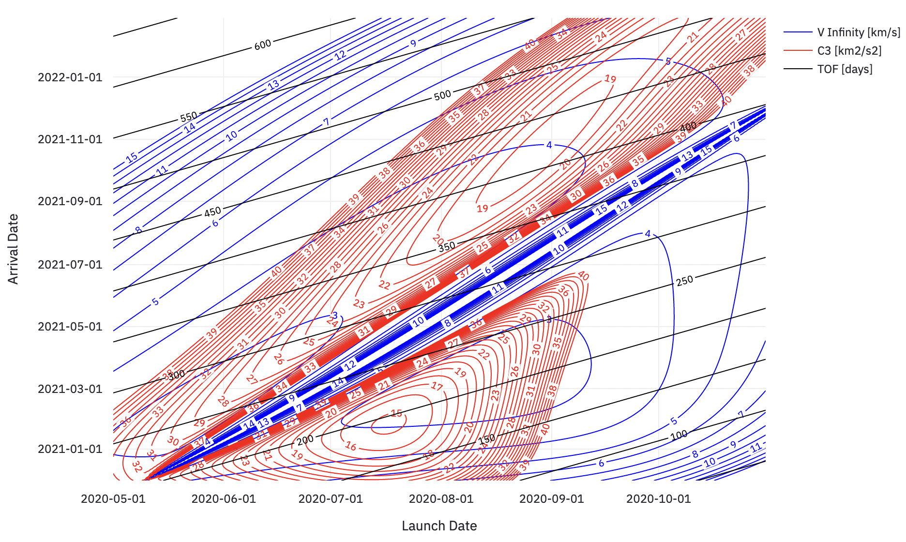

## Introduction

[Mission Planner](https://share.streamlit.io/astroscott/mission_planner/main/app.py) is a tool for planning interplanetary missions between any two planets in our solar system via dynamic, interactive porkchop plots. The tool uses the Vallado algorithm for solving Lambert's targeting problem. 

Assumptions: Patched conics, impulsive maneuvers, ballistic trajectories 
Ephemerides: de440s.bsp from NASA JPL [/naif/generic_kernels/spk/planets/](https://naif.jpl.nasa.gov/pub/naif/generic_kernels/spk/planets/) 

**Tip: Load times will increase quickly with increasing date ranges, raise calculation increment as needed.** 

**Tip: If you don't see anything after load, increase the date range and increase the contour upper bound.** 

 

## Download and Run a Local Copy (Python 3 Syntax)

Basic setup (windows):
Requires [Python 3.9.2rc1](https://www.python.org/downloads/release/python-392rc1/)

`pip install virtualenv` if you don't have it.

`cd /your/directory` 
`git clone https://github.com/astroscott/Mission_Planner` 
`python -m virtualenv -p "path\to\python3.9\python.exe" env` 
`env\scripts\activate.bat` 
`pip -r requirements.txt` 
`streamlit run app.py` 

If the application doesn't open automatically, open a browser and navigate to:
`http://localhost:8501`

## Usage Recommenations
If performing a search yourself for dates different than those listed below, use the following strategy: 
display only the Delta V plot, increase the calculation increment to between 10-30 (higher values require less calculation time), set the contour upper bound to 50, increase the contour line increment to 2, pick a departure year (ie: 2022-01-01 >> 2023-12-31), then set a large range of arrival dates (actual range depends on planet, see values below for an idea). After loading, when you see contours on the plot, adjust the dates until you have centered the contours. Once centered, lower the calculation increment to 1 for the highest resolution plot, and adjust other values as you see fit. 

## 2022 Launch Windows

Some convenient search windows for 2022 from Earth to each planet in our solar system, are as follows: 

Format (dep0, dep1) >> (arr0, arr1) : (c3_ub, vinf_ub, dv_ub) : cnt_inc 

where: 
&nbsp;&nbsp;&nbsp;&nbsp;&nbsp;&nbsp;dep0 = earliest departure 
&nbsp;&nbsp;&nbsp;&nbsp;&nbsp;&nbsp;dep1 = latest departure 
&nbsp;&nbsp;&nbsp;&nbsp;&nbsp;&nbsp;arr0 = earliest arrival 
&nbsp;&nbsp;&nbsp;&nbsp;&nbsp;&nbsp;arr1 = latest arrival 
&nbsp;&nbsp;&nbsp;&nbsp;&nbsp;&nbsp;c3_ub = characteristic energy contours, upper bound 
&nbsp;&nbsp;&nbsp;&nbsp;&nbsp;&nbsp;vinf_ub = excess energy contours, upper bound 
&nbsp;&nbsp;&nbsp;&nbsp;&nbsp;&nbsp;dv_ub = velocity increment contours, upper bound 
&nbsp;&nbsp;&nbsp;&nbsp;&nbsp;&nbsp;cnt_inc = contour line increment 

Earth >> Mercury: 
(2022-05-01, 2023-01-01) >> (2023-01-01, 2023-03-12) : (120, 30, 45) : 2  

Earth >> Venus: 
(2023-01-01, 2023-10-01) >> (2023-06-01, 2024-03-01) : (20, 20, 20) : 1  

Earth >> Mars: 
(2022-07-01, 2022-11-01) >> (2023-01-01, 2024-01-01) : (40, 15, 20) : 1 

... more to come ... 

## Validation

 
left: Conte, Davide & Spencer, David. (2015). [Targeting the Martian Moons via Direct Insertion into Mars' Orbit.](https://www.researchgate.net/publication/281378287_Targeting_the_Martian_Moons_via_Direct_Insertion_into_Mars%27_Orbit) 
right : Scott, Aaron. (2020). Mission_Planner. 

Small discrepancies exist as a result of variances in acquired ephemeris data and temporal resolution.
